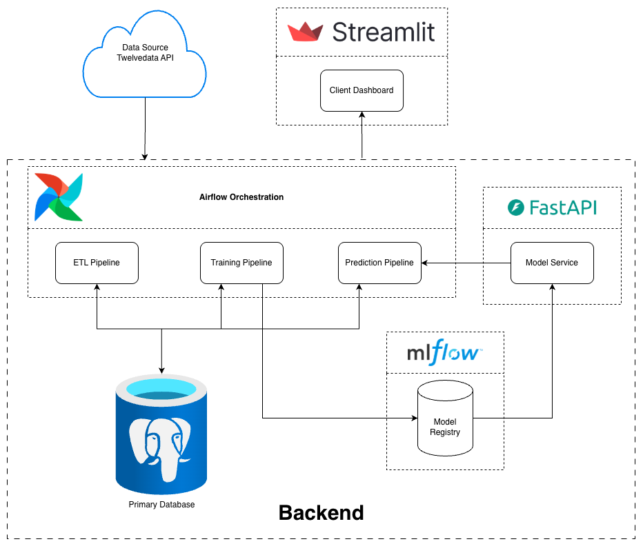
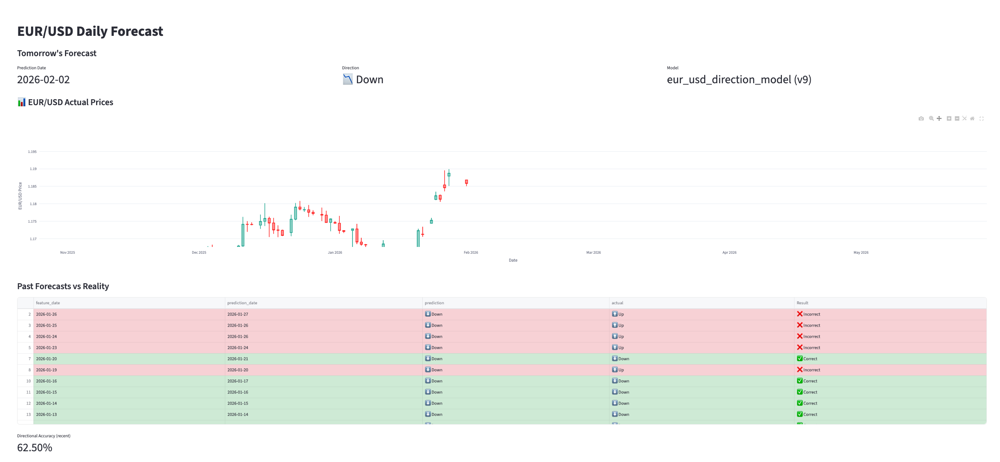
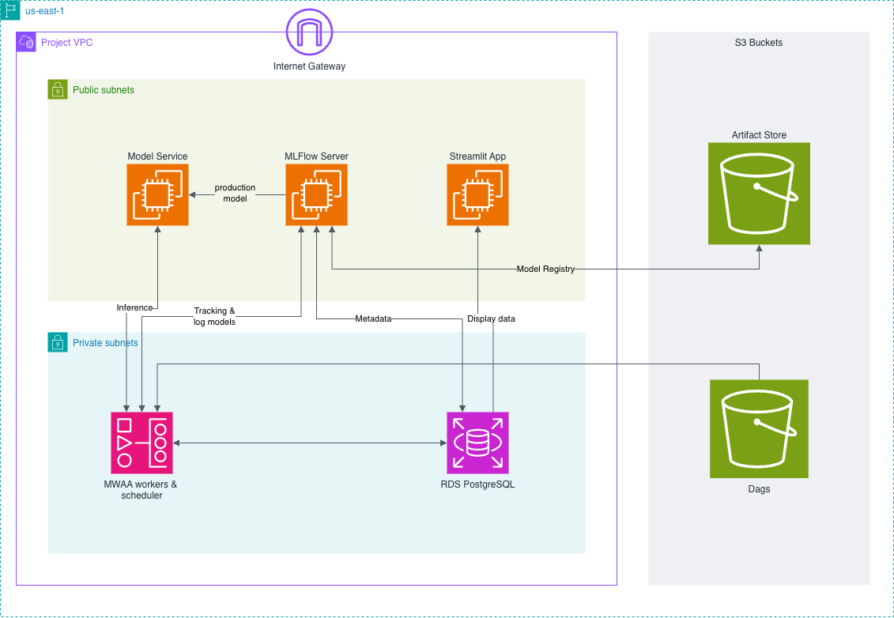

# 📈 Forex Forecasting MLOps System (EUR/USD)

An end-to-end **MLOps pipeline for daily EUR/USD directional forecasting**, covering data ingestion, ETL, model training, experiment tracking, model promotion (champion/challenger), inference.

This project focuses on **MLOps architecture**, modularity and scalibility rather than purely maximizing model accuracy.

---

## Project Overview

The system predicts the **next trading day direction** of EUR/USD:
- **1 → Price goes up**
- **0 → Price stays the same or goes down**

It is built with:
- **Apache Airflow** for orchestration
- **PostgreSQL** for data storage
- **MLflow** for experiment tracking and model registry
- **Docker** for containerization
- **Streamlit** for visualization
- **AWS MWAA** for cloud deployment

---

## High-Level Architecture



---

## Data Flow

### Tables
| Table | Purpose |
|-----|--------|
| `eur_usd_raw` | Raw daily OHLC data |
| `eur_usd_staging` | Transformed features |
| `eur_usd_final` | Cleaned, production-ready dataset |
| `eur_usd_predictions` | Daily model predictions |
| `eur_usd_train` | Model Training dataset |
| `eur_usd_test` | Model Testing dataset |

## Pipelines

### 1. ETL Pipeline (Daily)
- Runs **Monday–Saturday**
- Ingests daily Forex data from the **Twelvedata API**.
- Processes raw OHLC data, derives technical features, and stores the result in `eur_usd_final`.

### 2. Prediction Pipeline (After Database Update)
- Triggered whenever a change in `eur_usd_final` is detected.
- Runs inference on the **production model** via the **FastAPI Model Service** and  using latest features in `eur_usd_final`.
- Generates next-day directional forecast.
- Stores predictions in `eur_usd_predictions`.

### 3. Training Pipeline (Weekly – Sunday)
- Conducts full model lifecycle management and performance auditing.
- Performs:
  - Cross-validation across multiple models
  - Hyperparameter tuning on best model
  - Registers **Challenger model** to **MLFlow Model Registry**
  - Evaluates **Challenger vs Production**
  - Promotes if Challenger performs better
  - Archives old Production model

---

## Modeling

- Binary classification:
  - `1` → Up
  - `0` → Down or Flat
- Models supported:
  - Logistic Regression
  - Random Forest
  - XGBoost
- Time-series–aware ordering (no shuffling)
- Evaluation metric:
  - **Precision-Recall Area Under Curve Score(PR-AUR)**

---

## MLflow Usage

### What is logged
- Model parameters
- Hyperparameters
- Training & test metrics
- Model artifacts
- Input/output schema (signature)
- Test dataset as MLflow Dataset
- Model versions and lifecycle stages

### Model Lifecycle
- `None` → Challenger
- `Production` → Active model
- `Archived` → Replaced models

---

## Streamlit Dashboard


---

Features:
- **Next-day forecast**
- **Historical EUR/USD candlestick chart**
- **Past predictions vs actual outcomes**
- **Directional accuracy**
- Model metadata (name, version)

---

## Dockerized Services

- `airflow-webserver`
- `airflow-scheduler`
- `mlflow-server`
- `model-service`
- `streamlit-app`
- `postgres`
- `minio` (artifact storage)

All services communicate via a shared Docker network.

---

## Cloud Deployment



---
- **AWS MWAA** for Airflow
- **RDS PostgreSQL** for primary database and mlflow metadata
- **S3** for artifacts and dags
- **EC2** for services
- **Dashboard:** http://54.173.58.103:8501
- **Note:** The demo is hosted for a short duration to reduce costs. If the link above is down, please refer to the screenshots or setup local docker install.
---

## Local Installation

### 1. Clone Repo & Install Requirements
- Clone the git repo:
  ```bash
  git clone <your-repo-url>
  cd <repo-name >
  ```
- Then install dependencies (use uv for speed, or pip)
  ```bash
  uv sync
  ```
  or 
  ```bash
  pip install .
  ```
- Rename `.env.example` to `.env` with your variables and api keys

### 2. Prepare the Network
Since the architecture is decoupled across multiple compose files, they share a unified external docker network.
```bash
docker network create project-network
```

### 3. Launch the Services
Start the components using the following commands:
- Primary db and Airflow
  ```bash
  docker-compose -f docker/docker-compose.airflow.yaml up -d --build
  ```
- Model Service and Streamlit App
  ```bash
  docker-compose -f docker/docker-compose.model.yaml up -d --build
  ```
- MLFlow Server
  ```bash
  cd mlflow/docker-compose
  docker-compose up -d --build
  ```

### 4. Service Access Ports
Once the containers are healthy, the following interfaces are available:
| Service | Local URL | Port 
|-----|----|----|
| Airflow UI | http://localhost:8080 | 8080 |
| MLflow UI | http://localhost:5080 | 5080 |
| pgAdmin | http://localhost:5050 | 5050 |
| Dashboard | http://localhost:8501 | 8501 |

---

## Design Goals

- Emphasize **reproducibility**
- Clear **model governance**
- Safe **promotion logic**
- Avoid data leakage
- Production-first mindset

---

## Future Improvements

- Better feature engineering
- More advanced time-series models
- Model drift detection
- Alerts on performance degradation
- CI/CD for DAGs and services

---

## Author

**Atharv Verma**  
MLOps-focused project built for learning end-to-end industry-grade system design and AWS cloud deployment.

---

